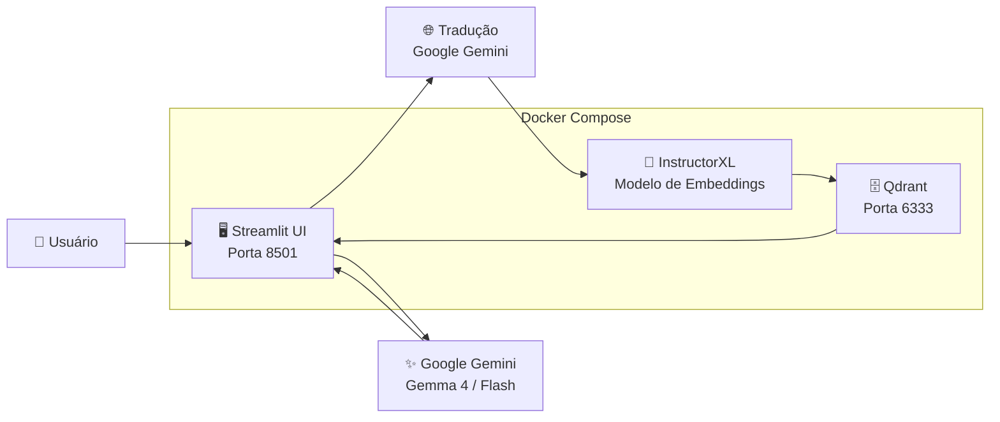

# 🗄️ SGBD Vetorial — Demo RAG com Qdrant

> **Universidade Federal de Goiás — Ciência da Computação**
> Disciplina: Sistemas Gerenciadores de Banco de Dados
> Professor: Leonardo Andrade Ribeiro

Demo de um **SGBD Vetorial (Qdrant)** com busca semântica em artigos do Arxiv e pipeline RAG integrado com **Google Gemini** (cadeia de fallback automática).

---

## 📋 Visão Geral

Este projeto demonstra as capacidades de um SGBD vetorial em contraste com SGBDs relacionais tradicionais:

- **Busca Semântica** — encontra artigos por similaridade de significado, sem palavras-chave exatas (suporta qualquer idioma via tradução automática)
- **Busca Híbrida** — combina vetores com filtro de texto no campo `abstract` em uma única operação HNSW
- **RAG (Retrieval-Augmented Generation)** — integração com LLM para respostas baseadas em evidências

## 🏗️ Arquitetura



| Componente | Tecnologia | Função |
|---|---|---|
| **SGBD Vetorial** | Qdrant | Armazena e busca vetores com índice HNSW |
| **Embeddings** | InstructorXL (768-dim) | Converte texto em vetores semânticos |
| **Tradução** | Google Gemini | Traduz consultas para inglês antes do embedding |
| **LLM** | Google Gemini (com fallback) | Gera respostas baseadas no contexto recuperado |
| **Interface** | Streamlit | UI web para demonstração interativa |
| **Orquestração** | Docker Compose | Gerencia todos os serviços |

### 🤖 Cadeia de Modelos (Fallback Automático)

Se o modelo principal estiver indisponível, o sistema tenta automaticamente o próximo:

1. **Gemma 4 27B** — modelo principal (Google open-weights)
2. **Gemini 3.1 Flash Lite** — fallback 1
3. **Gemini 2.5 Flash Lite** — fallback 2
4. **Gemini 2.5 Flash** — fallback 3 (último recurso)

## 📊 Dataset

Utilizamos o snapshot pré-vetorizado do Arxiv disponibilizado pelo Qdrant:

- **~2.25 milhões de artigos acadêmicos** com embeddings pré-computados
- **Modelo:** InstructorXL (768 dimensões, Cosine similarity)
- **Payload disponível:** `abstract` (texto do resumo), `doi` (identificador do artigo)
- **Índice de texto:** campo `abstract` indexado com tokenizador WORD para buscas híbridas eficientes

> **Nota:** Este snapshot pré-computado é minimalista por design (benchmarking semântico). Campos como título, autores e categorias **não estão presentes** no snapshot público.

---

## 🚀 Como Executar

### Pré-requisitos

- [Docker](https://docs.docker.com/get-docker/) e Docker Compose
- [uv](https://docs.astral.sh/uv/getting-started/installation/) (gerenciador de pacotes Python)
- Chave de API do Google AI Studio (gratuita): https://aistudio.google.com/apikey
- ~4 GB de espaço em disco (apenas para a imagem Docker)

### Setup Rápido

```bash
# 1. Clonar o repositório
git clone https://github.com/Igorbraziel/sgbd-vector-database.git
cd sgbd-vector-database

# 2. Criar arquivo .env e configurar GOOGLE_API_KEY
make env
# — ou —
cp .env.example .env
# Edite o .env e adicione sua chave: GOOGLE_API_KEY=sua-chave-aqui

# 3. Subir todos os serviços
make up
# — ou —
docker compose up --build -d

# 4. Carregar o snapshot do Arxiv no Qdrant (primeira vez)
# O Qdrant faz o streaming direto da URL — nenhum arquivo é salvo no disco
make init
# — ou —
docker compose exec app uv run python scripts/init_collection.py

# 5. Acessar a interface
# Abra http://localhost:8501 no navegador
```

### Desenvolvimento Local (sem Docker para o app)

```bash
# Instalar dependências
make install
# — ou —
uv sync

# Subir apenas o Qdrant via Docker
make qdrant
# — ou —
docker compose up qdrant -d

# Executar a UI localmente
make app
# — ou —
PYTHONPATH=. uv run streamlit run src/app.py
```

---

## 🛠️ Comandos Disponíveis

Execute `make help` para ver todos os comandos. Abaixo, cada comando `make` seguido do seu equivalente expandido:

### Instalação & Dependências

| Comando make | Equivalente expandido |
|---|---|
| `make install` | `uv sync` |
| `make install-dev` | `uv sync --all-extras` |
| `make lock` | `uv lock` |

### Desenvolvimento

| Comando make | Equivalente expandido |
|---|---|
| `make app` | `PYTHONPATH=. uv run streamlit run src/app.py` |
| `make init` | `docker compose exec app uv run python scripts/init_collection.py` |

### Docker

| Comando make | Equivalente expandido |
|---|---|
| `make up` | `docker compose up --build -d` |
| `make down` | `docker compose down` |
| `make restart` | `docker compose down && docker compose up --build -d` |
| `make logs` | `docker compose logs -f` |
| `make logs-app` | `docker compose logs -f app` |
| `make qdrant` | `docker compose up qdrant -d` |
| `make ps` | `docker compose ps` |
| `make shell` | `docker compose exec app /bin/bash` |

### Verificação & Saúde

| Comando make | Equivalente expandido |
|---|---|
| `make health` | `curl -sf http://localhost:6333/healthz` |
| `make collection-info` | `curl -sf http://localhost:6333/collections/arxiv_papers \| python3 -m json.tool` |

### Qualidade de Código

| Comando make | Equivalente expandido |
|---|---|
| `make lint` | `uv run ruff check src/ scripts/` |
| `make format` | `uv run ruff format src/ scripts/` |

### Limpeza

| Comando make | Equivalente expandido |
|---|---|
| `make clean` | `find . -type d -name __pycache__ -exec rm -rf {} +` |
| `make clean-all` | `docker compose down -v && rm -rf .venv` |
| `make env` | `cp .env.example .env` (só se `.env` não existir) |

---

## 📁 Estrutura do Projeto

```
sgbd-vector-database/
├── docker-compose.yml        # Orquestração: Qdrant + App
├── Dockerfile                # Imagem Python com uv
├── Makefile                  # Comandos de desenvolvimento
├── pyproject.toml            # Dependências (uv)
├── uv.lock                   # Lock de dependências
├── .env.example              # Template de variáveis de ambiente
├── src/
│   ├── config.py             # Configurações e variáveis de ambiente
│   ├── embedding.py          # Wrapper InstructorXL + tradução automática
│   ├── qdrant_client_setup.py # Cliente Qdrant (singleton)
│   ├── snapshot_restore.py   # Restauração do snapshot + criação de índices
│   ├── search.py             # Busca semântica, híbrida e multi-filtro
│   ├── rag.py                # Pipeline RAG com fallback de modelos
│   └── app.py                # Interface Streamlit
└── scripts/
    └── init_collection.py    # Script CLI de inicialização
```

---

## 🔗 Referências

- [Qdrant Documentation](https://qdrant.tech/documentation/)
- [Qdrant Practice Datasets](https://qdrant.tech/documentation/datasets/)
- [InstructorXL Model](https://huggingface.co/hkunlp/instructor-xl)
- [Google AI Studio](https://aistudio.google.com/)
- [Streamlit](https://streamlit.io/)
