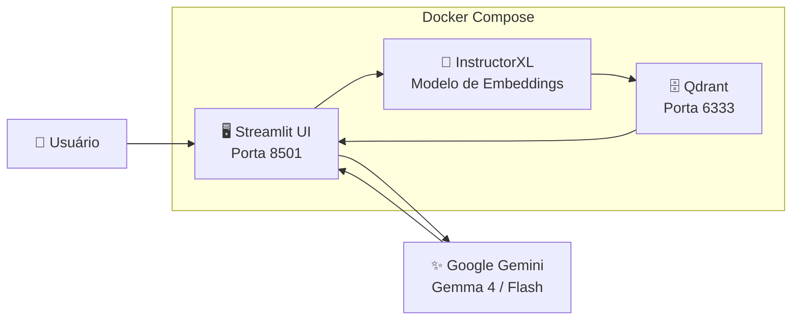

# 🗄️ SGBD Vetorial — Demo RAG com Qdrant

> **Universidade Federal de Goiás — Ciência da Computação**
> Disciplina: Sistemas Gerenciadores de Banco de Dados
> Professor: Leonardo Andrade Ribeiro

Demo de um **SGBD Vetorial (Qdrant)** com busca semântica em artigos do Arxiv e pipeline RAG integrado com **Google Gemini** (cadeia de fallback automática).

---

## 📋 Visão Geral

Este projeto demonstra as capacidades de um SGBD vetorial em contraste com SGBDs relacionais tradicionais:

- **Busca Semântica** — encontra artigos por similaridade de significado, sem palavras-chave exatas
- **Busca Híbrida** — combina vetores com filtros de metadados em uma única operação
- **RAG (Retrieval-Augmented Generation)** — integração com LLM para respostas baseadas em evidências

## 🏗️ Arquitetura



| Componente | Tecnologia | Função |
|---|---|---|
| **SGBD Vetorial** | Qdrant | Armazena e busca vetores com índice HNSW |
| **Embeddings** | InstructorXL (768-dim) | Converte texto em vetores semânticos |
| **LLM** | Google Gemini (com fallback) | Gera respostas baseadas no contexto recuperado |
| **Interface** | Streamlit | UI web para demonstração interativa |
| **Orquestração** | Docker Compose | Gerencia todos os serviços |

### 🤖 Cadeia de Modelos (Fallback Automático)

Se o modelo principal estiver indisponível, o sistema tenta automaticamente o próximo:

1. **Gemma 4 27B** — modelo principal (Google open-weights)
2. **Gemini 3.1 Flash Lite** — fallback 1
3. **Gemini 2.5 Flash Lite** — fallback 2
4. **Gemini 2.5 Flash** — fallback 3 (último recurso)

## 📊 Dataset

Utilizamos o snapshot pré-vetorizado do Arxiv disponibilizado pelo Qdrant:

- **~100k+ artigos acadêmicos** com embeddings pré-computados
- **Modelo:** InstructorXL (768 dimensões)
- **Payload:** título, resumo, autores, categorias, DOI, journal-ref

---

## 🚀 Como Executar

### Pré-requisitos

- [Docker](https://docs.docker.com/get-docker/) e Docker Compose
- [uv](https://docs.astral.sh/uv/getting-started/installation/) (gerenciador de pacotes Python)
- Chave de API do Google AI Studio (gratuita): https://aistudio.google.com/apikey
- ~4 GB de espaço em disco (imagem Docker + snapshot)

### Setup Rápido

```bash
# 1. Clonar o repositório
git clone https://github.com/Igorbraziel/sgbd-vector-database.git
cd sgbd-vector-database

# 2. Criar arquivo .env e configurar GOOGLE_API_KEY
make env
# Edite o .env e adicione sua chave: GOOGLE_API_KEY=sua-chave-aqui

# 3. Subir todos os serviços
make up

# 4. Restaurar o snapshot do Arxiv (primeira vez)
make init

# 5. Acessar a interface
# Abra http://localhost:8501 no navegador
```

### Desenvolvimento Local

```bash
# Instalar dependências
make install

# Subir apenas o Qdrant
make qdrant

# Executar a UI localmente
make app
```

---

## 🛠️ Comandos Disponíveis

Execute `make help` para ver todos os comandos:

| Comando | Descrição |
|---|---|
| `make install` | Instalar dependências com uv |
| `make app` | Executar Streamlit localmente |
| `make init` | Restaurar snapshot do Arxiv |
| `make up` | Subir todos os serviços Docker |
| `make down` | Parar todos os serviços |
| `make logs` | Ver logs em tempo real |
| `make health` | Verificar saúde do Qdrant |
| `make lint` | Verificar código com ruff |
| `make format` | Formatar código com ruff |
| `make clean` | Limpar caches |

---

## 📁 Estrutura do Projeto

```
sgbd-vector-database/
├── docker-compose.yml        # Orquestração: Qdrant + App
├── Dockerfile                # Imagem Python com uv
├── Makefile                  # Comandos de desenvolvimento
├── pyproject.toml            # Dependências (uv)
├── uv.lock                   # Lock de dependências
├── src/
│   ├── config.py             # Configurações e variáveis de ambiente
│   ├── embedding.py          # Wrapper InstructorXL
│   ├── qdrant_client_setup.py # Cliente Qdrant (singleton)
│   ├── snapshot_restore.py   # Restauração do snapshot Arxiv
│   ├── search.py             # Busca semântica e híbrida
│   ├── rag.py                # Pipeline RAG com fallback de modelos
│   └── app.py                # Interface Streamlit
├── scripts/
│   └── init_collection.py    # Script CLI de inicialização
└── guide/
    └── tg.md                 # Descrição do trabalho
```

---

## 🔗 Referências

- [Qdrant Documentation](https://qdrant.tech/documentation/)
- [Qdrant Practice Datasets](https://qdrant.tech/documentation/datasets/)
- [InstructorXL Model](https://huggingface.co/hkunlp/instructor-xl)
- [Google AI Studio](https://aistudio.google.com/)
- [Streamlit](https://streamlit.io/)
